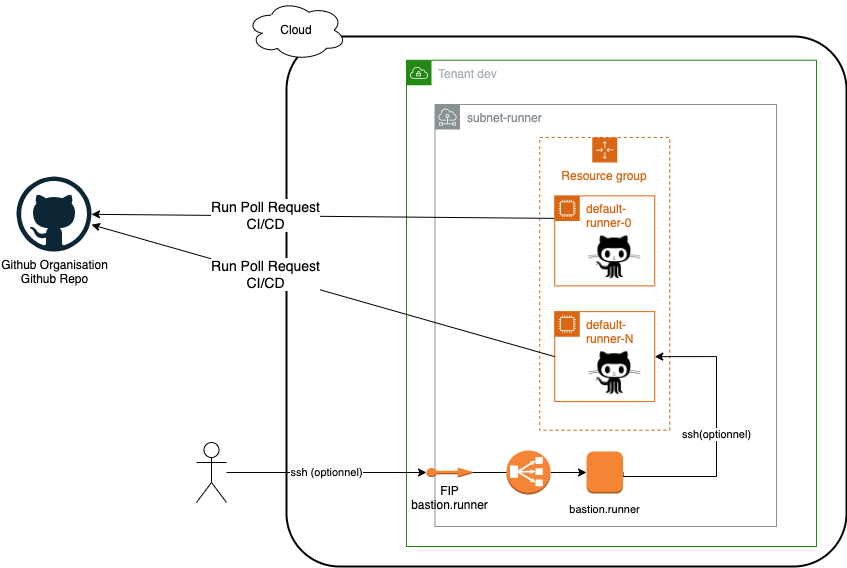

# self hosted github runner

Stack de déploiement de pool de runner github (self hosted github runner)

2 stacks de deploiement au choix sont disponibles:
  - `terraform`: par un module terraform/openstack
  - `heat`: par une stack Heat/Openstack

Les scripts `install-runner-scripts` de post install de runner github sont communs aux 2 modes deploiement. 

## Contenu de la Stack



Les ressources suivantes sont generees:
- un reseau/subnet privé
- un pool de runner github
- 1 (ou plusieurs routeurs et table de routage) suivant la topologie des clouds utilisé (publique ou privé)
- l accès SSH au runner est desactivé par defaut (inutile en fonctionnement normal)
- (Optionnel) si l accès SSH est necessaire pour debugger par exemple, alors une floating IP, un LoadBalancer, et un bastion sont generes

## Utilisation

Se rapporter aux repertoires de deploiement (terraform ou heat)

Les prequis sont:
- un tenant openstack, des credentials associés

Les parametres suivants doivent etre définis.

Selon le cloud, pour le deploiement des instances:
  - image OS "Ubuntu"
  - flavor
  - Si `boot on volume` activé, le volume type et la taille du disque root
  - routeur et table de routage (selon le cloud)
  - Nombre d instance runner à creer dans le pool (defaut: 1)

Pour l enregistrement des runners:
  - L URL du repo ou de l orga github pour enregistrer les runners
  - Le Token utilisé pour enregistrer les runners (https://docs.github.com/en/actions/hosting-your-own-runners/adding-self-hosted-runners)
  - le Label associé au pool de runners

Optionnel: SSH à activer pour le debug
  - (si ssh activé), la clef public ajoutée au compte de connexion `ubuntu`
  - (si ssh activé), la liste des users et clef publique à créé sur les instances


## Resultats

- Verifier si les runners sont enregistrés , dans le menu github, "your organisation" ou "repository", see `/settings/actions/runners`

- Pour utiliser ces runners dans un workflow
```
# Use this YAML in your workflow file for each job
runs-on: self-hosted, MY_LABEL
```
